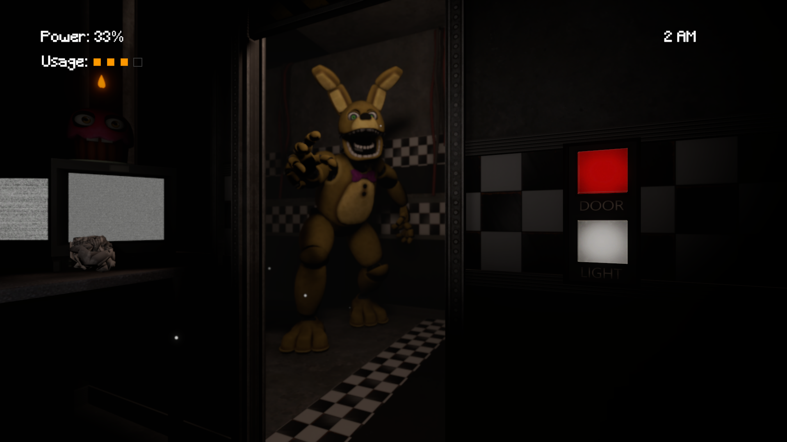
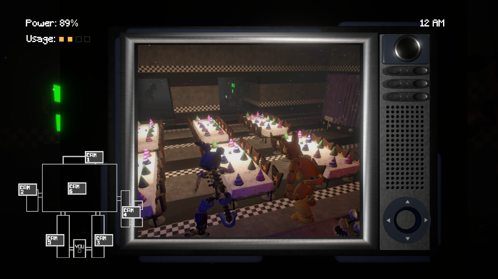

# OneNightAtFreddys

A small FNAF fangame made in Unity in under 24 hours as a personal project.

You play as a night security guard trying to survive until 6 AM. Watch the cameras, close the doors, manage your power, and try not to panic.

# Screenshots

# Controls

Mouse left/right : Look around the office
Mouse bottom edge : Pull up the camera monitor
Mouse top edge : Close the monitor
Click : Toggle doors, lights, and switch cameras

# Built With

Unity 6.3 URP
Made in under 24 hours
A lot of jump scares during testing

# Credits
Five Nights at Freddy's is created by Scott Cawthon. This is a fan-made game and is not affiliated with or endorsed by Scott Cawthon. No copyright infringement is intended.

# Assets Used

Freddy, Bonnie, Spring Bonnie, Endo 3D Models : OrangeSauceu https://sketchfab.com/orangesauceu
Map : skylajade69 https://sketchfab.com/skylajade69
All assets used are under a CC Attribution license.